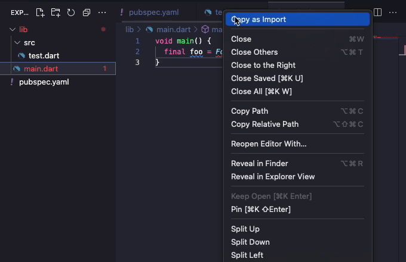

# Dart Copy as Import

Provides context menu actions in the editor and explorer to copy dart files as their `import 'package:<packageName>/<path>.dart'` format.

This package is specifically helpful over something like [Copy import](https://marketplace.visualstudio.com/items?itemName=billjohnston4.copy-import), due to it being specific to dart, and auto populating the package name in `pubspec.yaml`

## Features

You can either use the editor title context menu, or the explorer context menu to `"Copy as Import"`

## Known Issues

Currently only dart is supported, but other languages could be added as needed. Feel free to create an issue/pr